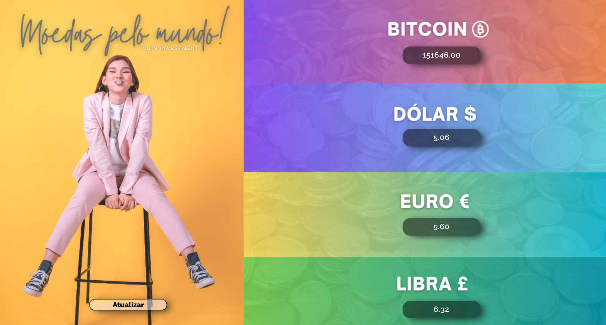

# API de Moedas Mundiais

> Output

- Esse projeto tem a funcionalidade de mostrar
o consumo de API de moedas mundiais em relação
a nossa moeda brasileira(R$) em tempo real

[🔗clique aqui para acessar projeto completo](https://eriksilva01.github.io/projeto-nlw/)

##  🛠 Tecnologias
- HTML
- CSS
- JS
- GitHub
- API

## 📩Contato
eriksilva.dev@hotmail.com
# api_moedas_mundiais
